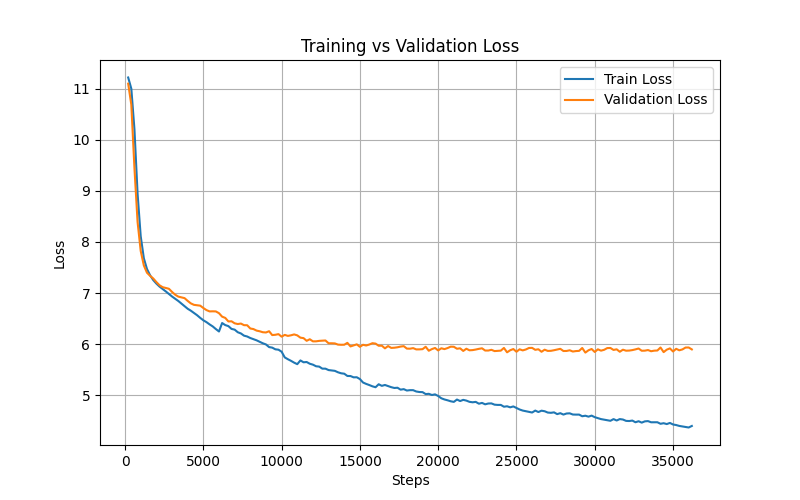

# Decoder-Only Transformer (GPT-Style) from Scratch

## Introduction
* This project implements a decoder-only Transformer (GPT-style) from scratch using PyTorch.
* All core components—including token embeddings, positional encoding, masked multi-head self-attention, and feed-forward networks—are built manually without relying on high-level abstractions.
* The model is trained for autoregressive text generation, enabling analysis of token relationships, attention patterns, and learning dynamics during training.

## Project Goals
* Implement a decoder-only Transformer from scratch to gain a deep, component-level understanding of GPT-style architectures  
* Analyze the impact of architectural choices and hyperparameters through controlled training experiments  
* Study how token representations, attention patterns, and language structure evolve during autoregressive training  
* Build a foundation for systematic experimentation on training dynamics, generalization, and overfitting behavior  

## Current Status
* Decoder-only Transformer fully implemented from scratch, including all core components  
* Model successfully trained on the dataset and supports autoregressive text generation  
* Training pipeline is stable and reproducible across runs  
* Currently in a deep experimentation phase, focusing on training dynamics, hyperparameter effects, and overfitting behavior  

## How to Run
```bash
git clone https://github.com/<your-username>/decoder-only-transformer-from-scratch.git
cd decoder-only-transformer-from-scratch

pip install -r requirements.txt

# Train the model
python main.py

# Generate text using a trained checkpoint
python generate.py

## Example Generated Text
Prompt: hello
Generated: helloains and transport the economy is now home . At the ground , the main couple 
ends along the estimated in the Mediterranean . The game again finished with Nesbid and juniora 
started the north side . By 04 , and August 3 , the former
```

**Note:** This is an early-stage model trained on a limited dataset. Generated text may appear nonsensical. The implementation demonstrates full end-to-end autoregressive generation and will improve with further training and hyperparameter tuning.

## Model Architecture

```text
Input IDs
    │
    ▼
Token Embeddings + Positional Embeddings
    │
    ▼
Dropout
    │
    ▼
┌───────────────────────────────┐
│        Decoder Layer × N      │
│  ┌─────────────────────────┐  │
│  │ LayerNorm               │  │
│  │ Multi-Head Attention    │  │
│  │ Residual Connection     │  │
│  │ LayerNorm               │  │
│  │ Feed Forward Network    │  │
│  │ Residual Connection     │  │
│  └─────────────────────────┘  │
└───────────────────────────────┘
    │
    ▼
Final Linear Layer → Logits
```

## Training Details & Preliminary Logs

> **Note:** The following parameters, metrics, and graphs are part of ongoing experiments. 
> They may change as the model is further trained or hyperparameters are adjusted.

### Model Hyperparameters (Preliminary)
- **d_model:** 128
- **num_heads:** 4
- **num_layers:** 4
- **max_seq_len:** 128

### Training Configuration (Preliminary)
- **batch_size:** 16
- **num_steps:** 100000
- **learning_rate:** 3e-4
- **grad_clip_value:** 1.0
- **eval_iters:** 100
- **print_every:** 200
- **seq_len:** 64
- **seed:** 42

### Regularization
- embedding_dropout: 0.1  
- attention_dropout: 0.1  
- residual_dropout: 0.1  

### Generation Settings
- temperature: 0.8  
- top_p: 0.8  
- max_new_tokens: 20  

### Training Metrics (Sample Logs)
| Step   | Train Loss | Train PPL | Val Loss | Val PPL |
|--------|------------|-----------|----------|---------|
| 5,000  | 6.47       | 644       | 6.71     | 818     |
| 10,000 | 5.85       | 348       | 6.15     | 467     |
| 15,000 | 5.32       | 204       | 5.95     | 383     |
| 20,000 | 4.99       | 146       | 5.88     | 357     |
| 25,000 | 4.75       | 116       | 5.85     | 348     |
| 30,000 | 4.57       | 97        | 5.85     | 346     |
| 35,000 | 4.43       | 84        | 5.86     | 350     |

### Training Graph (Preliminary)


> **Reminder:** The graph will be updated as the model trains further.